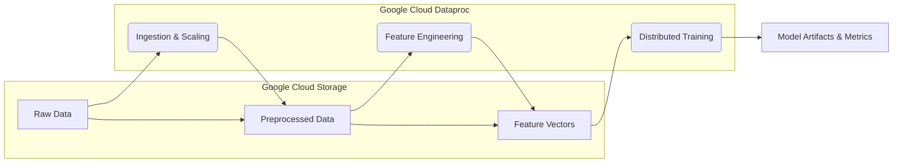

# Distributed Bitcoin Trend Prediction using Apache Spark and Google Cloud Dataproc

**Abstract**

This repository contains the implementation of a scalable, distributed machine learning pipeline designed to predict short-term price movements of Bitcoin. Leveraging the parallel processing capabilities of **Apache Spark (PySpark)** and the managed infrastructure of **Google Cloud Dataproc**, this project addresses the computational challenges associated with high-frequency financial time-series analysis. The system orchestrates an end-to-end workflow—from data ingestion and distributed preprocessing to feature engineering and model training—demonstrating the application of big data technologies in quantitative finance.

---

## 🏗 System Architecture

The utilized pipeline adheres to a tiered architecture, processing data through distinct stages of refinement. The system is deployed on a Google Cloud Dataproc cluster, utilizing Google Cloud Storage (GCS) as a centralized data lake.



## 📂 Repository Organization

The codebase is structured to separate infrastructural concerns from analytical logic:

*   **`jobs/`**: Contains the core PySpark scripts for the ETL and ML pipeline.
    *   `data-preprocessing.py`: Handles initial cleaning and vectorization.
    *   `data-scaling.py`: Applies scaling transformations to normalize feature distributions.
    *   `feature-engineering.py`: Generates technical indicators (e.g., Moving Averages, Volatility) and target variables.
    *   `eda.py`: Performs Exploratory Data Analysis on large-scale datasets.
    *   `training/`: Specialized scripts for training distributed models (Gradient Boosted Trees, Multilayer Perceptron, Random Forest).
*   **`infra/`**: Helper scripts for cloud resource management.
    *   `create_cluster.sh`: Automates the provisioning of the Dataproc cluster with necessary initialization actions.
    *   `submit-job.sh`: A wrapper for submitting PySpark jobs to the cluster with environment-specific configurations.

## 🔬 Methodology

The research workflow is implemented as follows:

### 1. Data Processing & Feature Engineering
Raw historical market data is ingested and subjected to rigorous preprocessing. Missing values are handled via Kaggle data filling and forward-fill to preserve temporal continuity. Feature engineering introduces technical indicators commonly used in financial econometrics, resulting in a high-dimensional feature space suitable for supervised learning.

### 2. Predictive Modeling
The project evaluates three distinct distributed classification algorithms:
*   **Gradient Boosted Trees (GBTs)**: Chosen for their effectiveness in capturing non-linear relationships in tabular data.
*   **Random Forest**: Utilized as an ensemble baseline to reduce variance and assess feature importance.
*   **Multilayer Perceptron (MLP)**: Implemented to explore the capacity of neural networks in modeling complex temporal dependencies.

Each model is trained using Spark MLlib, enabling data parallelism across worker nodes.

## 🚀 Infrastructure & Setup

### Prerequisites
*   **Google Cloud Platform**: A valid project with Dataproc and GCS APIs enabled.
*   **Google Cloud SDK**: CLI tool authenticated (`gcloud auth login`) and configured for your project.
*   **Python 3.9+**: For local script execution and dependency management.

### Cluster Provisioning
The `infra/create_cluster.sh` script facilitates the reproducible deployment of the computing cluster.

```bash
cd infra
./create_cluster.sh
```

*Note: Ensure the `.env` file is correctly configured with your `PROJECT_ID`, `REGION`, and `CLUSTER_NAME` before execution.*

## 🧪 Experimental Workflow

To reproduce the experimental results, jobs should be submitted sequentially to respect data dependencies.

**1. Data Preprocessing**
```bash
./infra/submit-job.sh --job-name data-preprocessing.py --cluster-name <YOUR_CLUSTER_NAME>
```

**2. Feature Engineering**
```bash
./infra/submit-job.sh --job-name feature-engineering.py --cluster-name <YOUR_CLUSTER_NAME>
```

**3. Model Training**
Training jobs require a data percentage argument to analyze model performance across varying dataset sizes.

```bash
# Example: Train GBT on 100% of the data
./infra/submit-job.sh --job-name training/gradient-boosted-trees.py --data-percentage 100
```

## 📊 Results & Evaluation

Model performance is evaluated based on standard classification metrics (Accuracy, Precision, Recall, F1-Score). Training artifacts and evaluation logs are automatically serialized and stored in the configured GCS bucket for post-hoc analysis.
